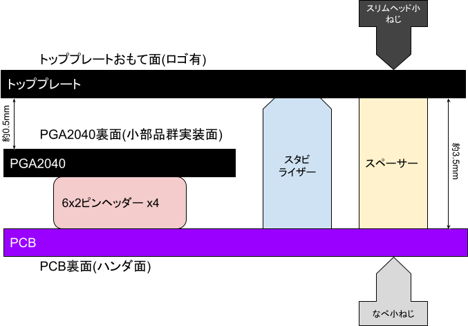

# YUIOP60Pi rev.3 ビルドガイド

## キット以外に必要なもの

### 部品

* Cherry MX互換キースイッチ - 60個 ([参考1][sw1], [参考2][sw2], [参考3][sw3])
* スタビライザー - 合計3個 ([参考1][st1], [参考2][st2])
  * 2u - 2個
  * 6.25u - 1個
* キーキャップセット - 1セット ([参考1][kc1], [参考2][kc2], [参考3][kc3])
* 60%キーボードケース (GH60, DZ60互換推奨) ([参考1][ca1], [参考2][ca2], [参考3][ca3])
* USB micro B ケーブル ([参考1][cb1], [参考2][cb2])

[cb1]:https://shop.yushakobo.jp/collections/accessory/products/usb-cable-micro-b-0-8m
[cb2]:https://talpkeyboard.net/items/5df82904a551d528d7360c34
[ca1]:https://shop.yushakobo.jp/collections/case/products/60-plastic-case
[ca2]:https://shop.yushakobo.jp/collections/case/products/1429
[ca3]:https://talpkeyboard.net/items/615ff26eacbcb077a5d5dd19
[kc1]:https://shop.yushakobo.jp/collections/keycaps/products/3272
[kc2]:https://shop.yushakobo.jp/collections/keycaps/products/2775
[kc3]:https://shop.yushakobo.jp/collections/keycaps/products/pbt-gray-dye-sub-keycaps
[st1]:https://shop.yushakobo.jp/collections/all-keyboard-parts/products/a0500st?variant=37665699463329
[st2]:https://talpkeyboard.net/?category_id=5f884b9b3313d216eb50558a&target=instock
[sw1]:https://shop.yushakobo.jp/collections/all-switches/cherry-mx-%E4%BA%92%E6%8F%9B-%E3%82%B9%E3%82%A4%E3%83%83%E3%83%81
[sw2]:https://talpkeyboard.net/?category_id=59cf8860ed05e668db003f5d&target=instock
[sw3]:https://kochikeyboard.stores.jp/?category_id=5f79187d07e16366f031382a&target=instock

### 機材

* ニッパー: ピンヘッダーのピンを切断するのに使います
* ハンダコテ: [FX600-02](https://ec.hakko.com/products/detail/4066) 推奨
  * コテ先: [T18-CF15](https://ec.hakko.com/products/detail/4186) 推奨
* コテ台+クリーナー: [633-01](https://ec.hakko.com/products/detail/3421) 推奨
* ハンダ線: 鉛入り 直径0.6mm 推奨
* フラックス
* ピンセット各種
* 精密プラスドライバー No.0
* 精密プラスドライバー No.00
* 拡大鏡 (オプション)
* テスター (オプション)
* ナットドライバー 対辺4mm (オプション)
* ヤスリ(オプション)

## ビルドの前に

下の図はYUIOP60Piの構造概要です。
各部品の位置関係を示しているので、組み立て時にこの図を意識していると間違いを減らせます。

* トッププレートとPCBは`YUIOP60Pi`というロゴが印刷されたほうが表(上)側です
* トッププレートとPCBの間にはPGA2040、スタビライザー、スペーサーが挟まります
* その他の電子部品はPCBの裏面にハンダ付けします
* PGA2040はRP2040が実装されている面を下、すなわちPCBのほうに向けます
* PGA2040とPCBは6x2ピンヘッダーを4個使って接続します

## ビルド手順

(TODO: 作業動画の該当部分へのリンクを追加)
(TODO: 必要に応じて図やイラストを追加)

1.  PGA2040にピンヘッダーをハンダ付けし余ったピンを切ります

    まずPCB表側の`U1`に6x2ピンヘッダー4個を挿入します。
    この時PCB自体を浮かせピンヘッダーが根元まで入るようにします。

    PGA2040をピンヘッダーに挿入します。
    PCBに挿入したピンヘッダーの上から、PGA2040の裏側を上にして、左に90度回転させてピンヘッダーに挿入します。
    PGA2040の小さな部品群が実装された面が上になります。
    回転方向はPGA2040上のロゴとPCBのシルク印刷も目安にしてください。

    PGA2040の裏側(上側)の四隅のピンヘッダーをハンダ付けし、4個のピンヘッダーを仮止めします。
    PGA2040とピンヘッダーの間に隙間ができないように気を付けてください。

    PGA2040側からはみ出たピンをPGA2040の部品よりも低くなるようにニッパー等で切断します。
    誤ってPGA2040上の部品を切断しないように気を付けてください。
    いったんピンヘッダーをPCBから取り外すと作業しやすいです。

    PGA2040の裏側(上側)のハンダ付けしてないピンヘッダー44箇所をハンダ付けします。
    スルーホール内のハンダ塗れを良くするためフラックスの使用を推奨します。
    ハンダを盛りすぎないように気を付けてください。
    目安としてはPGA2040上の部品群の高さを超えないことです。

    四隅のピンのハンダを温めなおして、切断した際の応力を抜きましょう。

    これでいったんPGA2040とピンヘッダーの工作は終了です。
    PCBから外してよけておきましょう。

2.  USBレセプタクル(`J1`)をハンダ付けします

    USBレセプタクル(以下レセプタクル)を`J1`に挿入します。
    レセプタクルの足がある方をPCB裏側に、USBケーブルを接続するほうを基板のエッジに向けて挿入します。

    USBレセプタクルの正しい位置を確認します。
    レセプタクルの取り付けには本キット中で最も高い精度が要求されます。
    レセプタクルから伸びる5本のピンとPCB上の対応する5個のパッドがピタリと合い、ピンが浮かない場所が正しい位置です。
    この位置はレセプタクルをPCBのエッジに軽く押し付ける、
    またはPCBを少し傾斜させることで得られます。
    この時点で正しい位置をよく確認しましょう。

    レセプタクルの手前側の足を1本だけハンダ付けし、仮止めします。
    ハンダコテを右で握るなら右手前の足を、左で握るなら左手前の足をハンダ付けします。
    ハンダ濡れを良くするためにフラックスの使用を推奨します。
    コテの温度は320℃が目安です。
    この際レセプタクルが熱くなるので火傷しないように注意してください。

    レセプタクルの位置を調整します。
    この時点で先に確認しておいたレセプタクルの正しい位置になるように微調整してください。
    先にハンダ付けした1本の足を温めながらピンセット等で位置を調整します。
    正しい位置に納まったらゆっくりとハンダコテを離し、
    ハンダが固まったのを確認してから再度正しい位置にあるかを確認しましょう。

    レセプタクルの残りの足3箇所をハンダ付けし、固定します。
    手前側はPCB裏側から、残り2か所はひっくり返して表側からハンダ付けしてください。
    ハンダ濡れを良くするためにフラックスの使用を推奨します。
    近くに別の部品用のパッドがあるためハンダを盛りすぎないように気を付けましょう。

    レセプタクルのピンをハンダ付けします。
    コテの温度は270℃が目安です。
    コツとしてはピンとパッドにフラックスを塗り、コテ先にハンダを少しだけ融かし付け、それをピンとパッドに当てて少し待つ感じです。
    仮にピン同士がブリッジしても気にせず、まずは全部のピンとパッドにハンダが回ることを優先しましょう。

    ピン同士のブリッジがある場合にはリカバリーします。
    ブリッジした場所にフラックスを塗り綺麗に清掃したコテ先を当てると、余分なハンダをコテ先に移すことでリカバリーできます。
    1回で取り切れない場合は複数回同じことを繰り返しましょう。

    ハンダの付けすぎには注意してください。
    コテ先がT18-CF15であれば直径0.6mmのハンダ線を2mm融かすのを2回くらいの量で、ピンとパッドのハンダ付けには充分足ります。
    ハンダを付けすぎるとピン同士だけではなく、レセプタクルカバーにブリッジしてしまいます。
    カバーとの間でブリッジした場合はコテの温度を320℃まで上げたほうがリカバリーはしやすいです。

    この時点でレセプタクルのハンダ付けが成功しているかテスターでテストできます。
    詳しくは[USBレセプタクルのテスト](#test-usb-receptacle)を参照してください。

3.  ショットキーバリアダイオード(`DS1`)とリセッタブルヒューズ(`F1`)をハンダ付けします

    `DS1`は取り付け方向が決まっているのでチップ上の縦線をシルク印刷の縦線の方向に合わてください。

    `F1`は取り付け方向が決まっていません。

    ハンダ付けの詳細な手順は[表面実装部品のハンダ付け](#soldering-smd-parts)を参考にしてください。

4.  RGB LEDを取り付けます (オプション)

    RGB LEDを取り付けない場合はこの一連の工程は省略できます。

    1.  抵抗2個(`R1`, `R2`)をハンダ付けします。

        とても小さな部品であるため失くさないように取り扱いに注意してください。
        取り付け方向は決まっていませんが、黒い面(`103`との印字がある面)を上にするのが慣例です。

        ハンダ付けの詳細な手順は[表面実装部品のハンダ付け](#soldering-smd-parts)を参考にしてください。

    2.  MOSFET(`Q1`)をハンダ付けします

        小さな部品であるため失くさないように取り扱いに注意してください。

        ハンダ付け箇所は3箇所あります。
        チップの3本の足と、3箇所のパッドを合わせるようにハンダ付けしてください。

        ハンダ付けの詳細な手順は[表面実装部品のハンダ付け](#soldering-smd-parts)を参考にしてください。

    3.  コンデンサ2個(`C1`, `C4`)をハンダ付けします

        PCBには`C1`から`C4`までありますが`C1`と`C4`だけハンダ付けすれば充分です

        とても小さな部品であるため失くさないように取り扱いに注意してください。
        取り付け方向は決まっていません。

        ハンダ付けの詳細な手順は[表面実装部品のハンダ付け](#soldering-smd-parts)を参考にしてください。

    3.  WS2812C-2020(以下LED)を56個(`LED1`から`LED56`)をハンダ付けします

        小さな部品であるため失くさないように取り扱いに注意してください。
        また湿度に弱いため、湿気の高いところに置いたり、水に濡らさないようにしてください。

        キットには予備が4つ含まれています。

        LEDは取り付け方向が決まっています。
        チップ裏の緑の縦線をシルク印刷の縦線の方向に合わせてください。
        方向は各行毎に統一されています。

        ハンダ付けの詳細な手順は[WS2812C-2020のハンダ付け](#soldering-ws2812c-2020)を参考にしてください。

5.  ダイオード60個をハンダ付けします

    スイッチソケットの傍にあるダイオード用のパッドにダイオードをハンダ付けしてください。

    ダイオードは取り付け方向が決まっています。
    チップ上の縦線をシルク印刷の縦線の方向に合わせてください。
    ダイオードの方向はPCB全体で統一されています。

    小さな部品であるため失くさないように取り扱いに注意してください。

    ハンダ付けの詳細な手順は[表面実装部品のハンダ付け](#soldering-smd-parts)を参考にしてください。

6.  スイッチソケット60個(`KSW1`から`KSW60`)をハンダ付けします

    スイッチソケットをPCB裏側にハンダ付けしてください。

    スイッチソケットには方向があります。
    ソケットの樹脂部分の方向をシルク印刷に合わせてください。

    ハンダ付けの詳細な手順は[キースイッチソケットのハンダ付け](#soldering-sockets)を参考にしてください。

7.  表面実装タクタイルスイッチ(`RSW1`)をハンダ付けします

    `RSW1`のパッドに合わせてタクタイルスイッチをハンダ付けします。
    方向は決まっていません。

    ハンダ付けの詳細な手順は[表面実装部品のハンダ付け](#soldering-smd-parts)を参考にしてください。

8.  PGA2040(`U1`)をPCBにハンダ付けして余ったピンを切ります

    PGA2040とピンヘッダーをPCB表側から挿入し、PCB裏側からハンダ付けします。

    まず四隅の内の1箇所をハンダ付けし、PCBとピンヘッダーの間に隙間ができないように調整します。

    次に四隅の残った3箇所をハンダ付けし仮固定します。

    PCB裏側からはみ出たピンをなるべく低くなるようにニッパー等で切断します。
    誤ってPCBのパターンを傷つけないように気を付けてください。
    特にPCBのエッジのほうは入手性の高いプラスチックケースと干渉しやすいことがわかっているので可能な限り低くしてください。

    PCBの裏側のハンダ付けしてないピンヘッダー44箇所をハンダ付けします。
    スルーホール内のハンダ塗れを良くするためフラックスの使用を推奨します。
    ハンダを盛りすぎないように気を付けてください。

    四隅のピンのハンダを温めなおして、切断した際の応力を抜きましょう。

9.  スタビライザーを取り付けます

    `KSW30`, `KSW42`, `KSW58`にスタビライザーを取り付けます

    トッププレートを取り付けてしまうと後からスタビライザーを取り付けるのは困難なので注意してください。

10. PCBとトッププレートをスペーサーとネジで固定します

    トッププレートはあらかじめ裏面から削っておくとキースイッチが抜けにくくなります。
    詳しくは[トッププレートの加工](#modifying-topplate)を参照してください。

    1.  PCBの裏側からなべ小ねじ(銀色)を挿入し、表側から六角スペーサーで止めます(計6箇所)
    2.  トッププレートをスペーサーを挟むようにPCBに重ね、表からスリムヘッド小ねじで止めます(計6箇所)

    取り付け時にねじは緩めにしておき、最後に軽く締めるくらいが良いです。

11. キースイッチを挿入し、ケースに取り付け、キーキャップを取り付けたら完成です

## ファームウェアの書き込み手順

ボタン(`RSW1`)を押しながらYUIOP60PiをUSBケーブルを接続する(≒YUIOP60Piの電源を入れる)とUSBドライブとして認識されます。
そのドライブにファームウェアのファイル(例: yuiop60pi.uf2)を書き込めばファームウェアの書き込みは完了です。
書き込みが終わると自動的にドライブは取り外されYUIOP60Piがキーボードとして機能します。

ファームウェアは以下のリンクからダウンロードしてください。
拡張子は `.uf2` です。

* [最新版][firmware_latest]
* [VIA対応版 v0.1(開発中止)][firmware_via]

ファームウェアのレポジトリは[koron/yuiop60pi][firmware_repo]です。
オープンソースとしてソースコードを公開していますので自由にご利用ください。

[firmware_repo]:https://github.com/koron/yuiop60pi/
[firmware_via]:https://github.com/koron/yuiop60pi/releases/download/v0.1/yuiop60pi_v0.uf2
[firmware_latest]:

## ビルドのTIPS

### <a id="test-usb-receptacle">USBレセプタクルのテスト</a>

(TODO: 書く)

### <a id="soldering-smd-parts">表面実装部品のハンダ付け</a>

表面実装部品のハンダ付けの手順は以下のようになります。

1.  1つのパッドにハンダを盛ります

    コテ先にハンダを少し融かし付け、それを1つのパッドに当て移します。
    右手でコテを握るならば右側のパッドを推奨します。

2.  部品をパッドの傍に準備します

    ピンセットを用いてパッドの傍に部品を置きます。
    このとき取り付け方向が決まっている部品は方向を合わせておきます。

3.  パッドに盛ったハンダを融かし部品を差し入れます

    1で盛ったハンダを融かして、部品の足をその中に差し入れます。

4.  位置を調整してコテを離し固定されるのを待ちます

    ピンセットを用いて左右上下、さらに部品が浮いてないか慎重に位置を調整します。
    位置が決まったら部品をピンセットで固定したまま、ゆっくりとコテを離します。
    この時ハンダに角が立ってしまう場合がありますが、それはステップ6で修正します。
    その後ハンダが冷めて固まってからピンセットを離します。

5.  残るパッドを(全て)ハンダ付けします

    ステップ1と同様、コテ先にハンダを少し融かし付け、それをパッドと部品の足に当てハンダで接続・固定します。
    この時フラックスを塗っておくとハンダが付きやすくなります。

6.  最初にハンダ付けしたパッドをレタッチします

    ステップ4でハンダ付けした箇所にフラックスを塗り、
    清掃したハンダコテを当ててレタッチし、余分なハンダを取り除いたりフラックス不足によるハンダ不良を修正したりします。

ダイオードなどの同じ部品を複数ハンダ付けする場合は、
ステップ1まで、4まで、5、6といった感じでそれぞれの工程を全部品に対してまとめて行うと効率が良くなります。

### <a id="soldering-ws2812c-2020">WS2812C-2020 (RGB LED)のハンダ付け</a>

(TODO: 書く)

### <a id="soldering-sockets">キースイッチソケット</a>

コテの温度は320℃が目安です。
ハンダ付けの手順は以下の通りになります。

1.  ソケットをシルク印刷に合わせて置きます
2.  ハンダコテを右手で握る場合はソケットの右側

(TODO: 書く)

### <a id="modifying-topplate">トッププレートの加工</a>

Cherry MX互換スイッチは固定の際にはトッププレートが1.5mm厚であることを想定しています。
一方でキットに含まれるトッププレートは1.6mmと少し厚くなっています。
そのためスイッチの状態によってはキーキャップの交換時など、キースイッチが比較的抜けやすい状態になりえます。

これを緩和し抜けにくくするために、
トッププレートの各キースイッチの穴の上辺と下辺を、
トッププレートの裏側からヤスリを用いて幅10mmくらいを
斜め45度で面取りするように軽く数回こすります。
これだけで格段にキースイッチが抜けにくく安定します。

具体的な作業方法は作業動画の中の
[トッププレートの加工](https://www.youtube.com/watch?v=MzpG4a6XjD8&t=265s)
を参考にしてください。

## ファームウェアのTIPS

(TODO: 要望・余裕があったら書く)
