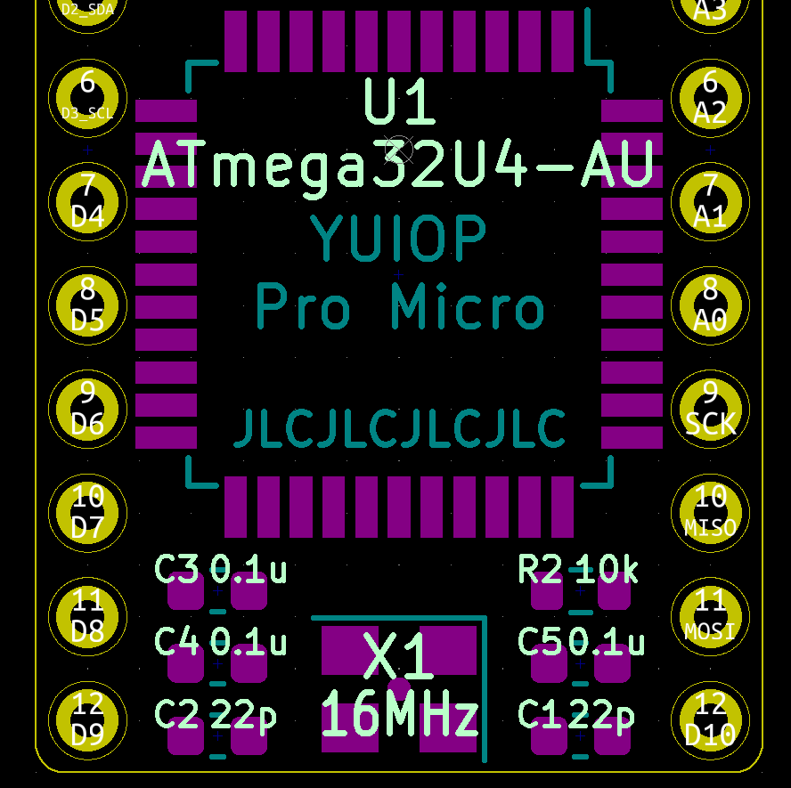

# YUIOP/PM (Pro Micro)

YUIOP/PMはPro Micro互換ボードのミニマルな互換ボードです。

## Build Guide

必要な部品は以下の通りです。
順序は推奨取り付け順となっています。

1. `J1` ヒロセ USB microB ミッドマウントコネクタ ZX62M-B-5P 1個

    <https://www.hirose.com/product/p/CL0242-0024-7-30>

    ピンが細いため取付位置に注意してください。

2. `X1` セイコーエプソン 表面実装型クリスタル 16MHz FA238-16MHz 1個

    <https://akizukidenshi.com/catalog/g/gP-02457/>

    ランドが狭く部品のシェル(GND)と短絡しやすいので気を付けてください。
    取り付け方向はおそらく関係ありません。

3. `U1` Microchip/Atmel MCU ATmega32U4-AU 1個

    <https://akizukidenshi.com/catalog/g/gI-09835/>

    上列の最も右のピンが1ピンです。
    シルク印刷とチップ上の `●` を参照し方向を合わせてください。

4. `F1` リセッタブルヒューズ 1個

    <https://akizukidenshi.com/catalog/g/gP-15300/>

    取り付け方向は関係ありません。

5. `D_Schottky` ショットキーバリアダイオード 1個

    <https://akizukidenshi.com/catalog/g/gI-01398/>

    取り付け方向に注意してください。
    カソードが右です。シルク印刷と部品上の縦棒を参考に方向を合わせてください。

6. 抵抗

    取り付け方向は関係ありません。

    1. `R3`, `R4` 22Ω 2個

        <https://www.sengoku.co.jp/mod/sgk_cart/detail.php?code=EEHD-57FD>

    2. `R1`, `R2` 10kΩ 2個

        <https://www.sengoku.co.jp/mod/sgk_cart/detail.php?code=EEHD-57GX>

7. コンデンサ

    取り付け方向は関係ありません。

    1. `C8` 1μF 1個

        <https://akizukidenshi.com/catalog/g/gP-14526/>

    2. `C7` 4.7μF 1個

        <https://akizukidenshi.com/catalog/g/gP-07505/>

    3. `C3`, `C4`, `C5`, `C6` 0.1μF 4個

        <https://akizukidenshi.com/catalog/g/gP-13374/>

    4. `C1`, `C2` 22pF 2個

        <https://akizukidenshi.com/catalog/g/gP-13313/>

## Diagrams

基板上には部品番号を示す記号が一切ありません。
以下の画像を取付位置の参考にしてください。

### 全体図

### 上側拡大図

### 下側拡大図

